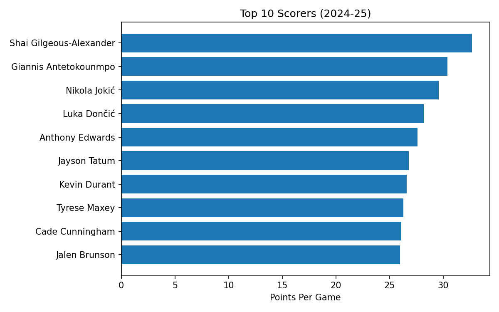
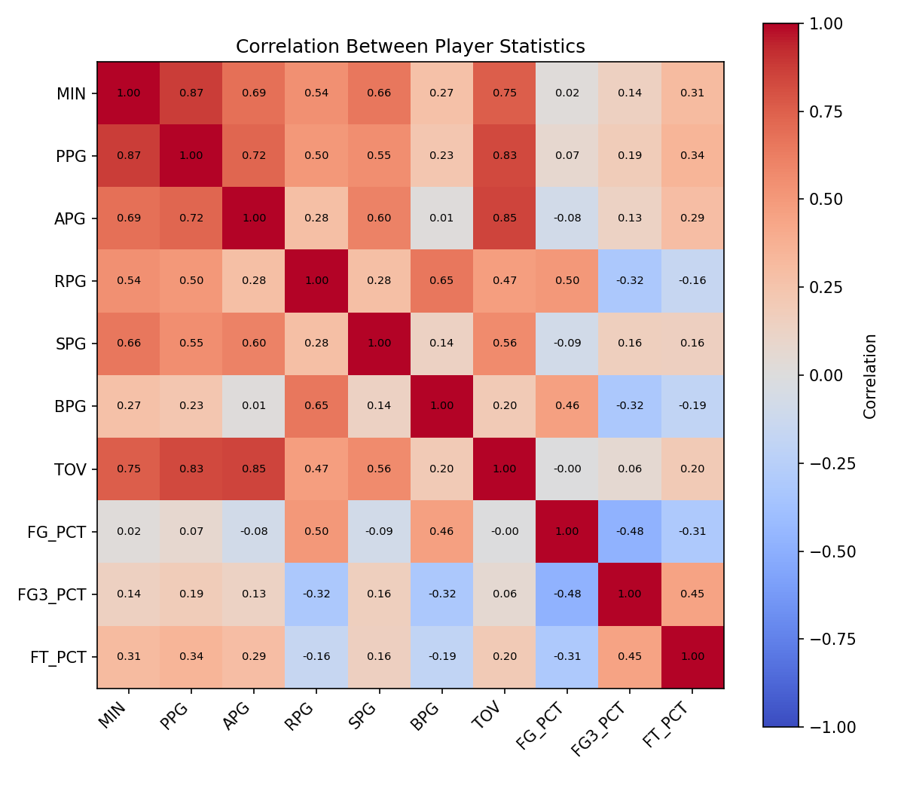
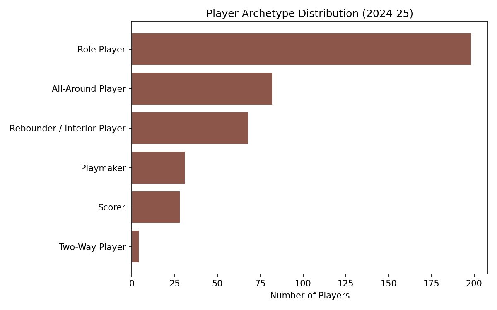
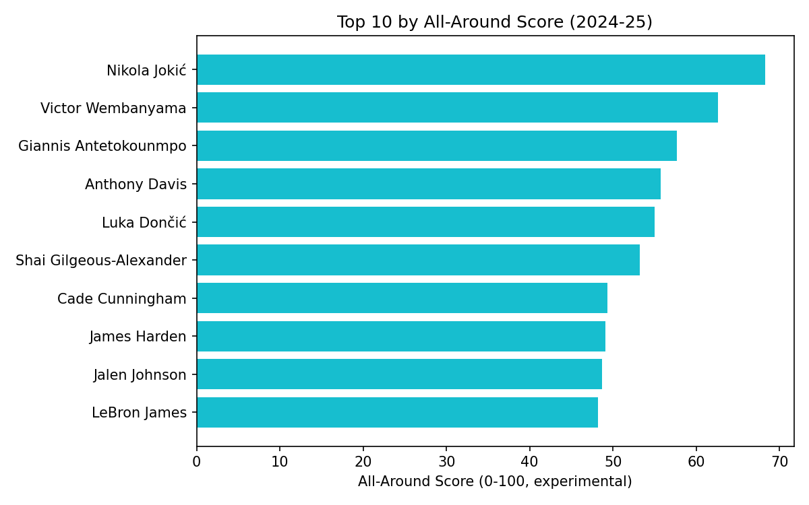

# NBA Player Profiles: Understanding Different Types of NBA Players Through Data

A beginner-friendly data analysis project that builds statistical "profiles" for NBA players from the 2024-25 regular season, and uses simple, transparent rules to answer: **what makes different NBA players statistically unique, and can we group them into meaningful types without machine learning?**

## Analysis Question

Using per-game and per-36-minute statistics, this project asks:

- What makes different NBA players statistically unique?
- Which players are primarily scorers, playmakers, rebounders, or all-around players?
- How do star players compare across statistical categories?
- Which players are efficient relative to their scoring volume?
- Which statistics tend to move together?
- Can we build a simple, reusable "player profile" for any given player?

## Dataset

- **Source:** NBA.com stats, accessed via the [`nba_api`](https://github.com/swar/nba_api) Python package (no API key required).
- **Scope:** 2024-25 NBA regular season, per-game player statistics, with player position merged in from team rosters.
- **Size:** 569 players pulled originally; 411 remain after filtering out players with fewer than 20 games played or fewer than 10 minutes per game (see [Data Cleaning](#analysis-performed)).
- The one-time pull script is at [`data/fetch_data.py`](data/fetch_data.py). Re-running it refreshes the raw CSV; the notebook itself never calls the internet.

## Tools Used

- **Python 3**
- **pandas** — data loading, cleaning, aggregation
- **matplotlib** — all charts (bar charts, scatter plots, a correlation heatmap)
- **Jupyter Notebook** — the analysis itself, in [`notebooks/nba_player_analysis.ipynb`](notebooks/nba_player_analysis.ipynb)
- **nba_api** — one-time data collection

No machine learning is used anywhere in this project.

## Analysis Performed

1. **Load & understand the data** — shape, dtypes, missing values, duplicates, summary statistics.
2. **Data cleaning** — trimmed 68 raw columns to 14 clearly-named ones; filled 41 missing `POSITION` values with `"UNK"` rather than dropping real stat rows; filtered out players with fewer than 20 games or 10 minutes per game to remove small-sample noise (569 → 411 players).
3. **Exploratory data analysis** — top 10 scorers/assist leaders/rebounders, most efficient high-volume scorers, minutes-vs-points and assists-vs-turnovers relationships, and a full correlation heatmap across 10 major stats.
4. **Feature engineering** — points/assists/rebounds per 36 minutes, and an experimental "All-Around Score" (0-100) combining five normalized stat categories.
5. **Player archetypes** — six transparent, rule-based categories (Scorer, Playmaker, Rebounder/Interior Player, Two-Way Player, All-Around Player, Role Player) built from percentile thresholds, with the logic and its limitations documented in the notebook.
6. **`player_profile(name)`** — returns a full stat line, archetype, and All-Around Score for any player, plus a chart comparing them to the league average.
7. **`compare_players(name_a, name_b)`** — a side-by-side comparison table and chart for any two players.
8. **Insights** — 8 findings, each tracing an observation back to a specific number or chart earlier in the notebook.

## Key Findings

- **Playing time drives raw production**: minutes correlate 0.87 with points per game — a major reason per-36 stats matter for fair comparison.
- **Assists come with turnover risk**: assists and turnovers are the most correlated pair in the dataset (0.85) — raw turnover counts alone are a poor measure of ball security.
- **Specialization is the norm**: the top-10 lists for scoring, assists, and rebounding barely overlap — only Nikola Jokić appears in all three.
- **FG% has a built-in bias**: field goal percentage and 3-point percentage are *negatively* correlated (-0.48), so a simple "efficiency" ranking by FG% systematically favors centers over 3-point shooters.
- **A combined score tells a different story than scoring alone**: Nikola Jokić leads the experimental All-Around Score despite ranking 3rd in scoring; Victor Wembanyama ranks 2nd without leading any single category outright.
- **True two-way threats are rare**: only 4 of 411 rotation players (1%) qualify as "Two-Way Player" under our rules, versus 198 (48%) as "Role Player."

(Full write-ups with evidence for all 8 insights are in the notebook's final section.)

## Example Visualizations

**Top 10 scorers, 2024-25:**



**Correlation between major player statistics:**



**Player archetype distribution:**



**Top 10 by experimental All-Around Score:**



More charts (efficient high-volume scorers, minutes-vs-points, assists-vs-turnovers, top assists, top rebounders) are in [`outputs/charts/`](outputs/charts/).

## Skills Demonstrated

- **Python** — functions, dictionaries, control flow, string matching
- **pandas** — loading, filtering, grouping, merging, renaming, summary statistics
- **Data cleaning** — documented, reasoned decisions about missing values, column selection, and sample-size filtering
- **Exploratory data analysis** — leaderboards, scatter plots, correlation analysis
- **Feature engineering** — per-36 normalization, a custom composite score with min-max scaling
- **Data visualization** — bar charts, scatter plots, a correlation heatmap, all built with matplotlib
- **Analytical thinking** — transparent, rule-based classification instead of a black-box model; explicit acknowledgment of each method's limitations
- **Communicating data insights** — Observation → Evidence → Interpretation write-ups grounded in the actual analysis

## How to Run This Project

1. Clone the repository and install dependencies:
   ```
   pip install -r requirements.txt
   ```
2. (Optional) Refresh the dataset — pulls the latest available season from the NBA stats API:
   ```
   python data/fetch_data.py
   ```
3. Open the notebook and run all cells top to bottom:
   ```
   jupyter notebook notebooks/nba_player_analysis.ipynb
   ```
4. Explore any player yourself from inside the notebook:
   ```python
   player_profile("Anthony Edwards")
   compare_players("Anthony Edwards", "Jayson Tatum")
   ```

## Project Structure

```
data/
  fetch_data.py                          # one-time data pull (nba_api)
  nba_player_stats_2024_25.csv           # raw pulled data
  nba_player_stats_2024_25_clean.csv     # after cleaning (Step 2)
  nba_player_stats_2024_25_features.csv  # after feature engineering + archetypes (Steps 4-5)
notebooks/
  nba_player_analysis.ipynb              # the full analysis
outputs/
  charts/                                # all saved chart images
requirements.txt
README.md
```
